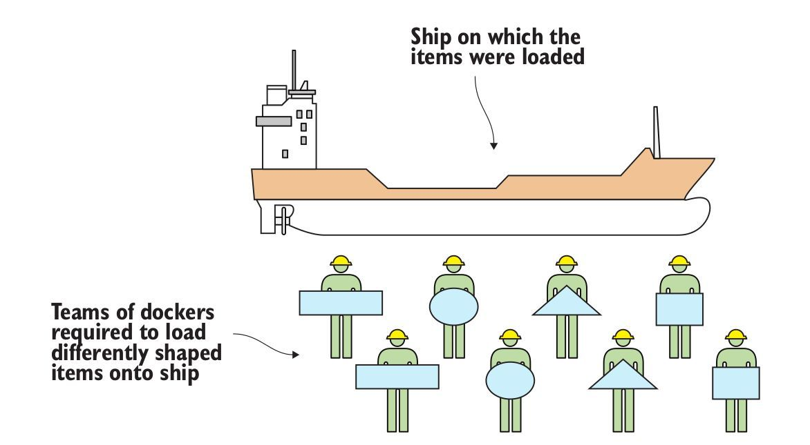
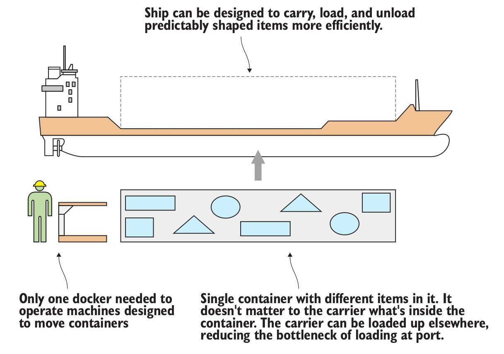
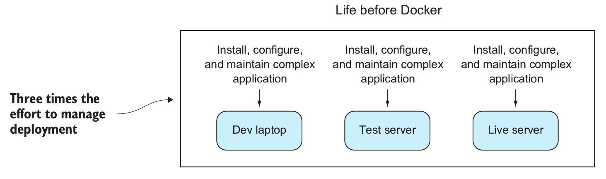
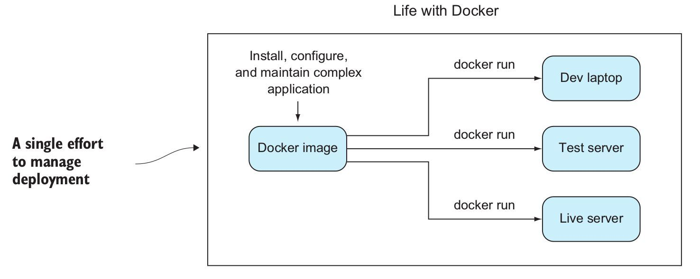

## Docker介绍

> Docker is a platform that allows you to “build, ship, and run any app, anywhere.” It has come a long way in an incredibly short time and is now considered a standard way of solving one of the costliest aspects of software: deployment.
>
> Docker是一个平台，允许“build, ship, and run any app, anywhere”。它在极短的时间内走了很长一段路，现在被认为是用于解决软件部署问题的标准方法，而部署是软件最昂贵的方面之一。

Docker 在容器的基础上，进行了进一步的封装，从文件系统、网络互联到进程隔离等等，极大的简化了容器的创建和维护。使得 Docker 技术比虚拟机技术更为轻便、快捷。

### Docker的比喻

> 备注：来自书籍 "Docker In Practice" chapter 1.1.1 What is Docker? 这个例子很有意思，特意摘录过来。

要了解Docker是什么，从隐喻开始比使用技术解释更容易，而Docker本身是一个强大的隐喻：Docker的本意是码头工人。码头工人是这样的劳动者：当船只停靠在港口时，码头工人将商品移入和移出船只。箱子和物品的大小和形状各不相同，经验丰富的码头工人因其能够以经济有效的方式手工将货物装入船舶而受到重视。雇人搬东西并不便宜，但别无选择。

在有Docker之前，不同团队的码头工人被要求装载不同形状的物体到船上去：

有Docker之后：

- 船被设计为可以更有效的携带，装载和卸载预设形状的物品
- 不同的物品放在同样一个简单的容器中。载体不关心容器里面是什么
- 载体可以装载到其他地方，减少了港口装载的瓶颈
- 仅需一个码头工人来操作设计用来移动容器的机器

对于工作在软件方面的人来说，这应该是熟悉的。花费了大量时间和智力，将隐喻奇怪形状的软件变成了不同大小的异形船，其中包含其他形状奇特的软件，因此它们可以出售给其他地方的用户或企业。

下图显示了如何使用Docker概念来节约时间和金钱：

在Docker之前，将软件部署到不同的环境需要付出巨大的努力。即使您不是手动运行脚本来在不同的计算机上配置软件（并且很多人仍然这样做），您仍然需要与配置管理工具搏斗，这些工具可以在日益快速发展而缺乏资源的环境上管理状态。即使将这些工作封装在VM中，也花费了大量时间来管理这些VM的部署，等待它们启动，以及管理它们创建的资源使用开销。

有了Docker，配置工作与资源管理分离，从而使得部署工作非常简单：运行docker run，环境镜像被拉下并准备运行，消耗更少的资源，不干扰其他环境。

无需担心容器是否将被运送到RedHat机器，Ubuntu机器或Cent OS VM映像; 只要它上面有Docker，就可以了。

在有docker之前，需要管理不同的环境下的部署：

有docker之后只需要一次努力就可以管理在多个环境下的部署：

##不同于传统虚拟化

下面的图片比较了 Docker 和传统虚拟化方式的不同之处。传统虚拟机技术是虚拟出一套硬件后，在其上运行一个完整操作系统，在该系统上再运行所需应用进程；而容器内的应用进程直接运行于宿主的内核，容器内没有自己的内核，而且也没有进行硬件虚拟。因此容器要比传统虚拟机更为轻便。

传统虚拟化:

Docker:

### 参考资料

- 书籍 "Docker In Practice" chapter 1.1.1 What is Docker? 
- [docker----从入门到实践：什么是docker一节](https://yeasy.gitbooks.io/docker_practice/content/introduction/what.html)

