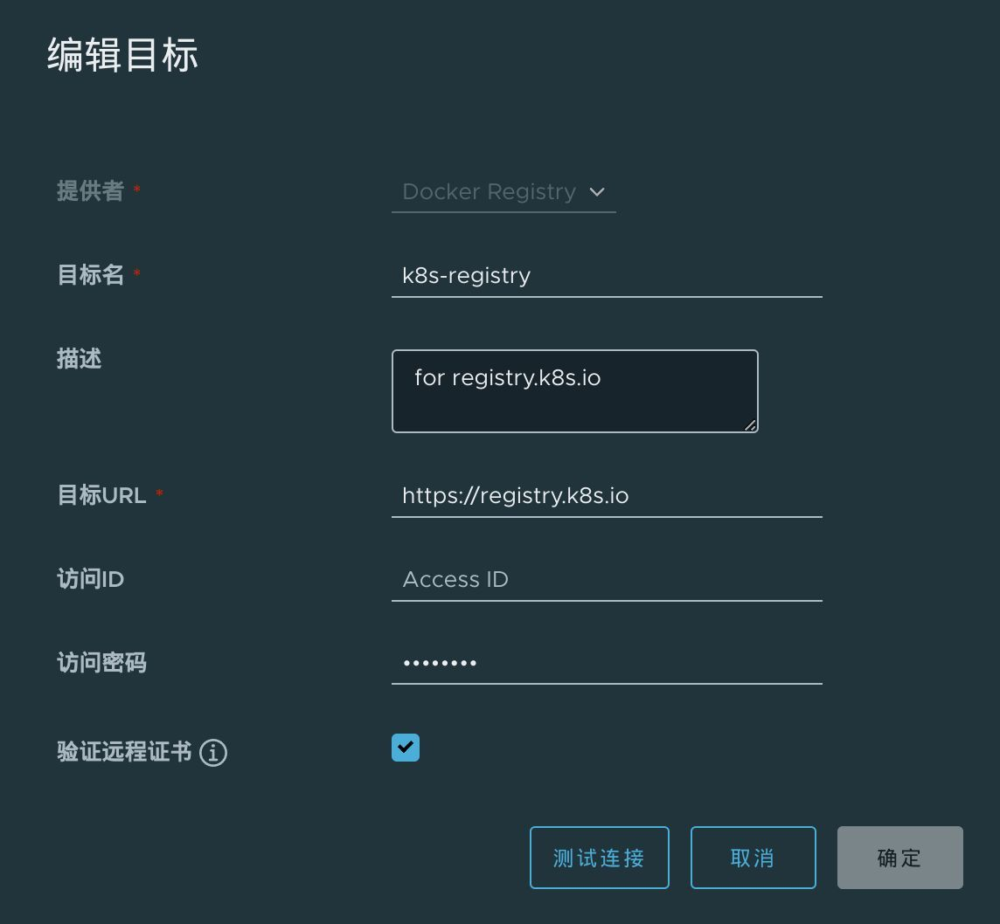
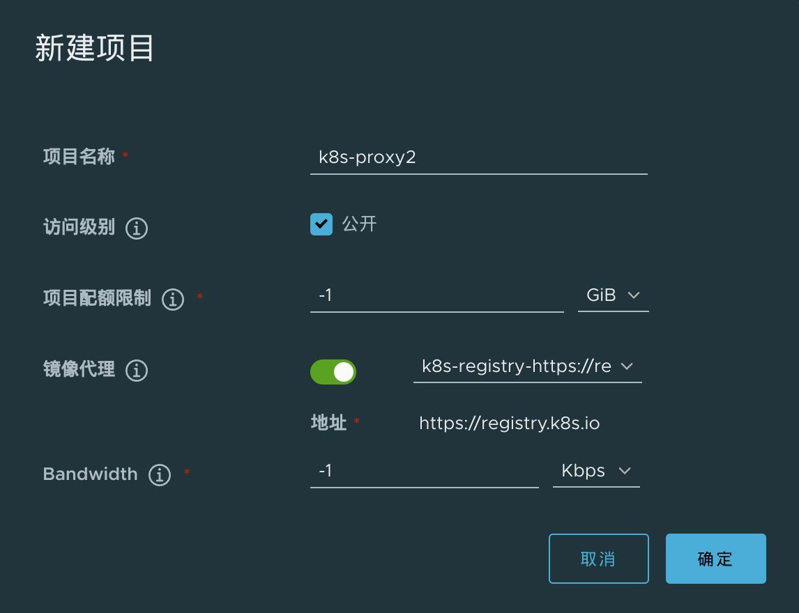
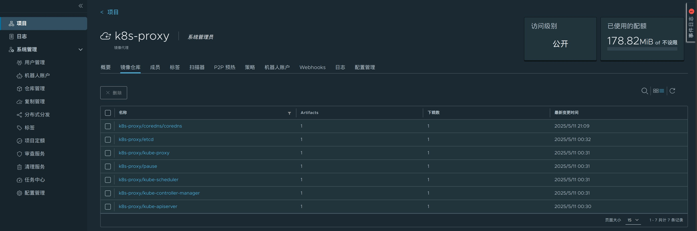

## k8s 代理仓库

为了加速 k8s 的安装和使用，创建 k8s 代理仓库。



- 名称： k8s-proxy
- 目标 URL： https://registry.k8s.io

再创建一个 project，名为 k8s-proxy，设置为镜像代理，指向上面创建的 k8s 的代理仓库：



之后就可以这样拉取镜像：

```bash
docker pull 192.168.3.91:5000/k8s-proxy/kube-apiserver:v1.33.0
docker pull 192.168.3.91:5000/k8s-proxy/coredns/coredns:v1.12.0
```

这是安装 k8s v1.33 版本后的镜像情况：

