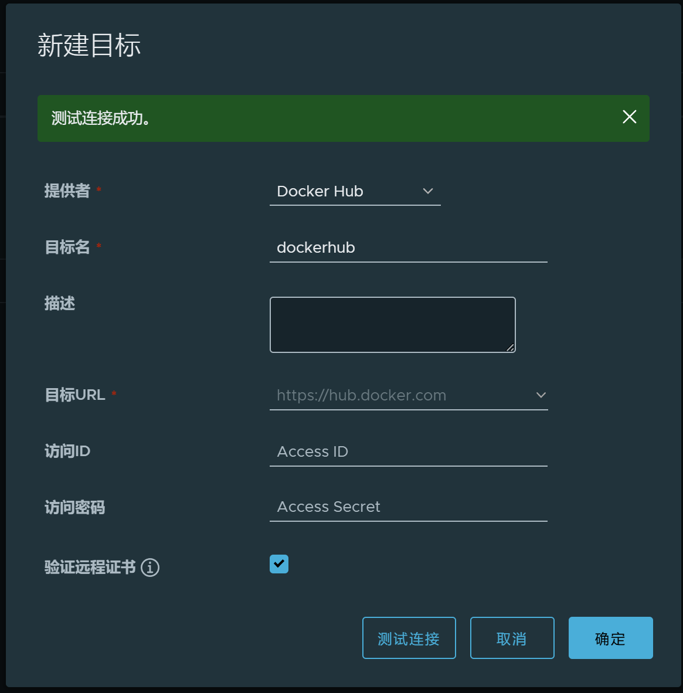
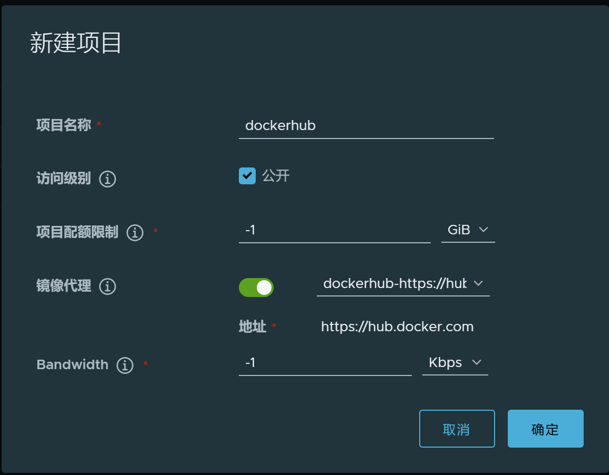

## 新建仓库

"系统管理" -》 "仓库管理" 下，点"新建目标", 




## 新建项目

新建项目，指向刚才新建的仓库：




## 使用代理仓库

使用新建的代理仓库 pull 镜像：

```bash
$ docker pull 192.168.3.193:5000/dockerhub/library/hello-world:latest
```

从日志可以看到，镜像是从代理仓库拉取的：

```bash
latest: Pulling from dockerhub/library/hello-world
Digest: sha256:56433a6be3fda188089fb548eae3d91df3ed0d6589f7c2656121b911198df065
Status: Downloaded newer image for 192.168.3.193:5000/dockerhub/library/hello-world:latest
192.168.3.193:5000/dockerhub/library/hello-world:latest
```

或者直接用 docker run 命令执行：

```bash
docker run 192.168.3.193:5000/dockerhub/library/hello-world:latest
```


