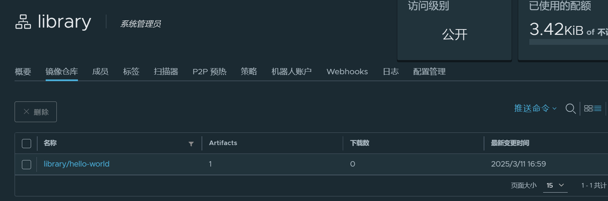

## 容许使用 http

habor 安装时默认建立了一个 library 的公共仓库，可以用来存储公共镜像。

因为我们没有开启 https，因此使用前要先修改配置文件:

```bash
sudo vi /etc/docker/daemon.json
```

添加如下内容:

```bash
{
  "registry-mirrors": ["xxxx"],
  "insecure-registries": ["192.168.3.221:5000"]
}
```

执行如下命令重启 docker 服务:

```bash
sudo systemctl daemon-reload
sudo systemctl restart docker
```

## 公共仓库

### 制作镜像

以 hello-world 镜像为例，执行：

```bash
docker run hello-world:latest
```

查看 hello-world 的镜像:

```bash
docker images
```

输入如下：

```bash
REPOSITORY                               TAG       IMAGE ID       CREATED       SIZE
hello-world                              latest    74cc54e27dc4   6 weeks ago   10.1kB
```

执行如下命令重新命名镜像名称

```bash
docker tag 74cc54e27dc4 192.168.3.221:5000/library/hello-world:latest
```

### 推送镜像到仓库

登录到 habor 仓库：

```bash
docker login  -u admin -p xxxx http://192.168.3.221:5000
```

推送镜像到仓库:

```bash
docker push 192.168.3.221:5000/library/hello-world:latest
```

输出为：

```bash   
The push refers to repository [192.168.3.221:5000/library/hello-world]
63a41026379f: Pushed
latest: digest: sha256:7565f2c7034d87673c5ddc3b1b8e97f8da794c31d9aa73ed26afffa1c8194889 size: 524
```

此时去 habor 页面查看，就可以看到推送上去的 hello-world 镜像了。



### 拉取镜像

拉取镜像的方式：

```bash
docker pull 192.168.3.221:5000/library/hello-world:latest
```

也可以直接用 docker run 拉取镜像：

```bash
docker run 192.168.3.221:5000/library/hello-world:latest
```

查看此时本地已有的 hello-world 镜像：

```bash
$ docker images

REPOSITORY                               TAG       IMAGE ID       CREATED       SIZE
hello-world                              latest    74cc54e27dc4   6 weeks ago   10.1kB
192.168.3.221:5000/library/hello-world   latest    74cc54e27dc4   6 weeks ago   10.1kB
```

能看到来自默认仓库的 hello-world 镜像，以及从本地 192.168.3.221:5000 仓库拉取的 hello-world 镜像。

## 私有仓库

TODO


