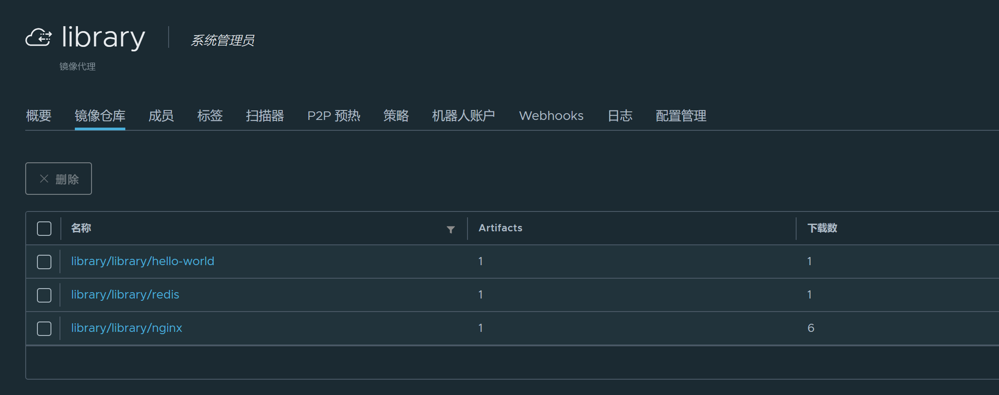

## 代理的问题

habor 代理仓库后，可以实现镜像下载的加速，但是使用上，镜像的名字需要指定完整的仓库地址。

```bash
docker run 192.168.3.221:5000/dockerhub/library/hello-world:latest
```

而不是我们不引入 habor 代理之前的简单方式：

```bash
docker run hello-world:latest
```

因此，普通的 habor 代理仓库在使用时，需要修改所有容器的部署文件，将镜像名称修改为带代理仓库前缀的镜像地址。

这会造成很大的麻烦。

## 透明代理

经过研究，我找到了 habor 做透明代理的方式，可以实现通过使用 habor 作为镜像代理来加快下载，又不需要修改镜像地址。

思路就是结合使用 habor 的镜像代理和 docker 的镜像加速。前面我们是这样设置 docker 的镜像加速地址的：

```json
{
  "registry-mirrors": ["https://registry.docker-cn.com"]
}
```

通过这个方式可以将镜像代理到 registry-mirrors 所指向的镜像仓库，它不需要修改镜像地址，也就是我们期望得到所谓的"透明代理"。仿照这个做法，如果我们将 registry-mirrors 设置为 habor 的仓库地址，是不是就可以同样透明使用 habor 作为镜像加速地址？然后，我们再把 habor 默认的 library 项目修改为 docker hub 代理仓库，就可以实现 docker hub 的带本地缓存加速的透明代理。

具体操作步骤如下：

1. 在 "仓库管理" 中新建 dockerhub 的仓库

2. 删除 habor 安装时自带的 library 项目。

3. 重新建立名为 library 的项目，将其设置为镜像代理，指向刚才新建的 dockerhub 仓库。

4. 修改 docker 的配置文件，添加代理仓库地址。

    ```bash
    vi /etc/docker/daemon.json
    ```

    内容修改如下：

    ```json
    {
      "registry-mirrors": ["http://192.168.3.221:5000/"],
      "insecure-registries": ["192.168.3.221:5000"]
    }
    ```

5. 重启 docker 服务。

    ```bash
    sudo systemctl daemon-reload
    sudo systemctl restart docker
    ```

6. 使用透明代理仓库下载镜像。

    ```bash
    docker pull hello-world:latest
    ```

    从日志上看镜像似乎是 docker.io 仓库拉取的：

    ```bash
    latest: Pulling from library/nginx
    Digest: sha256:9d6b58feebd2dbd3c56ab5853333d627cc6e281011cfd6050fa4bcf2072c9496
    Status: Image is up to date for nginx:latest
    docker.io/library/nginx:latest
    ```

    但是从 habor 的 library 代理仓库可以看到，之前为空的镜像仓库现在已经有了镜像，而且多 pull 几次（需要先清理本地镜像），下载数会相应增加：

    

    > 备注1：清理本地镜像，可以使用 `docker rmi -f $(docker images -q)` 命令。
    > 
    > 备注2：library 镜像仓库中的镜像数据，会延迟一点时间（分钟级别）才会显示出来，导致我开始还以为代理失败了。耐心等几分钟就能看到了。

## 遗留问题

如上图所示，library 镜像仓库中的镜像名称，会额外的带上 `library/library/` 前缀。

暂时不知道有什么方法可以解决。

